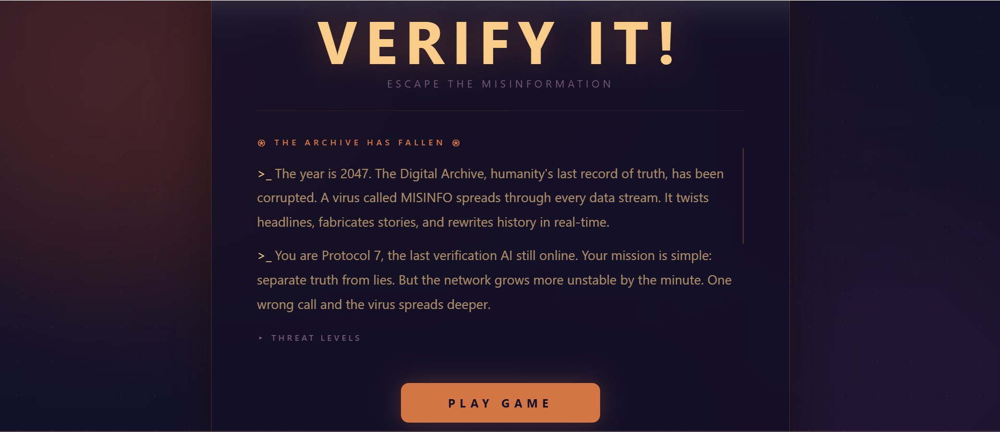
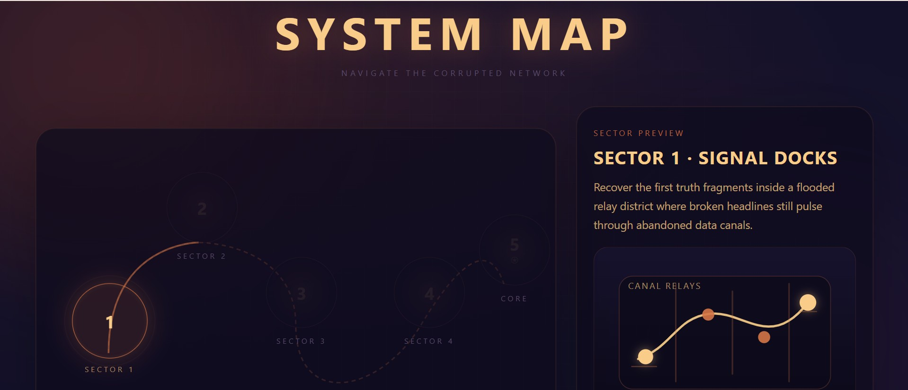
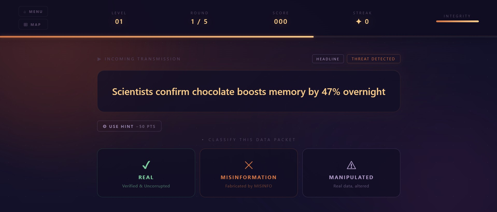
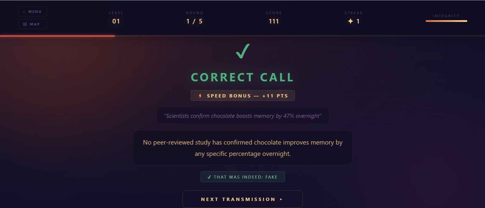

# Verify It! - Escape the Misinformation

## Overview

A media literacy game where you determine AI-generated news headlines, social media posts, statistics, and viral image reports as real, fake, or manipulated before the MISINFO virus corrupts the archive.

## What it Does 

Verify It! is a 5-level browser game that teaches players to identify misinformation in real time. Each round, the server calls the DigitalOcean Gradient AI API to generate a unique piece of content, this could include a news headline, social post, statistic, or viral image report, and the player must correctly classify it before the timer runs out.

### Features:

- AI-generated questions every round
- 4 different question formats: news headlines, social media posts, statistics and viral image reports
- Difficulty scales across 5 levels, questions get more difficult as you progress
- Countdown timer
- Streak bonus system, consecutive correct answers reward bonus points
- Hint system
- Integrity bar, wrong answers corrupt the archive
- Fallback to static questions if the API is unavailable

## How DigitalOcean Gradient AI is Used

The game uses the Gradient AI inference API (llama3.3-70b-instruct) as the core engine for content generation. On every round, server.js sends a structured prompt to the Gradient API that specifies: 

- A random question type (real / fake / manipulated)
- A random format (headline / social post / statistic / image report)
- A request for a hint, a one-sentence clue that teaches verification techniques without giving the answer away
- An explanation after the player answers

The API key is stored securely in a .env file and never exposed to the frontend. The frontend calls the Express /generate endpoint, which proxies the request to Gradient AI and returns the parsed question.

## Getting Your Gradient API Key 

1. Sign into your DigitalOcean account 
2. Navigate to “agent platform” located on the sidebar to your left
3. From there, click on “serverless interface”
4. Scroll down and click on “create model access key”
5. Create the secret API key and copy the key right away (You won’t get this chance again once you exit the page)

## Setup 

1. Clone the repository or download the project files to your local machine.
   ```bash
   git clone https://github.com/shimzawarraich/VerifyX.git
   ```

2. Navigate into the project folder
   ```bash
   cd Verifyx
   ```

3. Open the project in your desired IDE

4. Install dependencies:
   ```bash
   npm install 
   ```

5. Create your environment file
   ```bash
   cp .env.example .env
   ```

6. Add your Gradient API key to .env

   Open .env and replace "your_key_here" with your actual key

7. Start the server
   ```bash
   node server.js
   ```
   
   If the above produces an error, delete `node_modules` and reinstall
   ```bash
   rm -rf node_modules
   npm install
   ```
   Then start the server again
   ```bash
   node server.js
   ```

9. Open your browser and go to: http://localhost:3000

## Tech Stack 

- **Backend:** Node.js, Express
- **AI:** DigitalOcean Gradient AI — `llama3.3-70b-instruct`
- **Frontend:** Vanilla HTML, CSS, JavaScript
- **Storage:** localStorage

## Screenshots:

### Main Menu

### Game Map

### Gameplay



## Authors

- Malasa Khan
- Mehreen Morshed
- Muskan Morshed
- Shimza Warraich

## License

MIT
